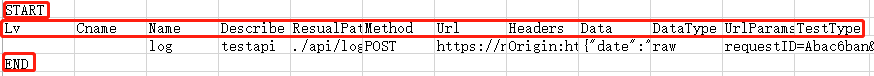

DetailedSteps
=======
在这里介绍如何使用 `bluetest` 一步一步完成工作。

首先让我们看下 `bluetest` 里的主要 ``.py`` 文件
    
   * ``logInit.py`` 日志相关
   * ``parm.py`` 配置参数
   * ``press.py`` 压测相关
   * ``toolbox.py`` 工具箱
   * ``dome_test.py`` 范例
   * ``core.py`` 接口基础测试相关
 

准备数据 
------
我们从第一步开始，准备数据。
按照我们的约定，做接口测试的源数据可以是 ``postman`` 里download下来的数据。如下图所示：

这样我们就获得了最原始的数据 ``test.json.postman_collection`` 名字很长，这是postman规定的，请暂时忍受一下。

由于这个文件的可读性比较差，而且不利于维护和使用，所以需要生成一个中间文件，在这里选用的是 ``csv`` 格式。

``csv`` 作为 `BlueTest` 的标准数据文件，为了支持这一实现方式。
  
还提供了 ``postman`` 文件, 标准 ``swagger`` ，标准 ``YAPI`` 一键转换为 ``csv`` 的功能
  
而且不用担心，如果你的数据源不是以上格式，在后面的详细介绍中，会有 ``csv``文件格式的详细说明。可根据说明，编写自己的测试数据一键转换功能。

.. code-block:: python

    BlueTest.initPostMan(name,result_path = "")
    
**initPostMan**
    

我们的一贯命名方式就是，中国式英语 - 命名风格。
顾名思义，这个函数的功能是初始化 ``postman`` 的数据。
调用方式可以有以下几种

.. code-block:: python

    BlueTest.initPostMan(name = "文件名缩写")  #test.json.postman_collection 则只需要 initPostMan（"test"）
    BlueTest.initPostMan(name = "文件完整路径") #完整的文件相对路径/绝对路径
    BlueTest.initPostMan(name = "文件名缩写",result_path = "转换后文件路径") 
    
result_path 不建议填写，不填写，会直接在 ``./srcdata/``  文件生成与数据源同名的文件，例test.json.postman_collection-> test.csv

initPostMan是如何工作的呢？

它的主要工作其实其实是进行文件名处理。除此以外的大部分功能其实是由我们一个类 `Class Postman2Csv` 来处理的。

首先initPostMan会将不确定的文件名（缩写，完整路径，绝对路径等） 进行处理后，变为标准格式后。将工作交于 `Class Postman2Csv` 。

.. code-block:: python

    postman2csv = BlueTest.Postman2Csv(path,result_path="")
    postman2csv.run()
    
**Postman2Csv**

PostMan文件转换为Csv所使用的类。除了一大堆为了处理各种各样奇怪情况的代码以外。主要的进行工作的函数有:

.. code-block:: python

    data = postman2csv.getData(Cookie=False)   
    
在这里有个常见的单词 `Cookie` ，由于PostMan导出的文件时常会带有一大堆很不重要的Cookie内容。为了降低后期的结果整理压力。在这里，我们默认关闭了Cookie选项。毕竟的用户鉴权，很多都不在Cookie里了，不论是单独的 Token,Sign 键值，还是Session方式。都更加流行。

当然，如果你还需要这个功能，可手动开启。

回到原来的话题，这个函数的功能是，用来获取 ``.postman_collection``

文件的内容。并输出标准一个漂亮的数组，数组的内容是一堆长得不是很讨人喜欢的字典键值。

这样，我们就对 ``.postman_collection`` 文件进行了漂亮的序列化。

这些数据的形状就任我们揉捏了。

揉捏好的数据，按照约定，我们将它们变成 ``csv`` 格式。这就使用到了下一个函数。

.. code-block:: python

    postman2csv.write2Csv(data)   
    
write2Csv = =  write to csv 。如果你还看不明白含义，那么不是你的英文太好。就是中文不太好。 ``写入文件为csv格式`` 

除了枯燥的将之前我们生成的漂亮数组 ``data`` 一条一条写入文件外。还增加了一些标志。用来加强可读性。

从上图可以看出，除了一行比较啰嗦的title以外，主要的标志有： ``START`` , ``END`` 

这两个标志位是用来规定每个测试用例的范围。

在这两个标志位以内就是一个测试用例，在这两个标志位以外的区域可以任由大家进行备注，而不影响测试用例。

也算是在可读性和易读性之间的一种平衡。

以上的所有工作做完之后。我们就从一个 ``.postman_collection`` 文件（也可以是 ``swagger`` ``YAPI`` ）转换为了 ``.csv`` 文件。

数据准备的第一步就此完成。请记住以上这么啰嗦的步骤，在使用时，在大部分情况下，都是以下一句话：

.. code-block:: python

    BlueTest.initPostMan(“数据源名称”)
    

接口测试 
------

在准备好数据后，我们就要开始正式的测试执行了。对于接口测试。最繁琐，而且最应该脚本化的就是，接口的基础测试。
包括 

